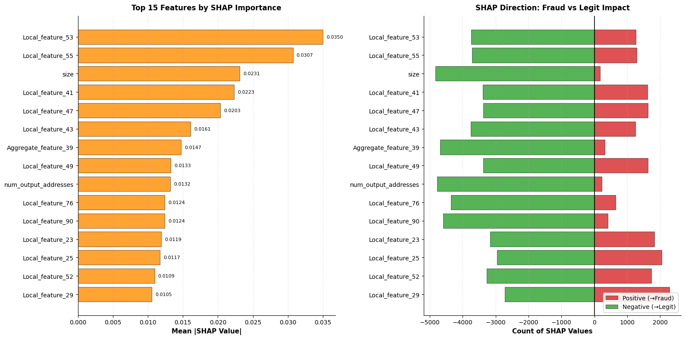
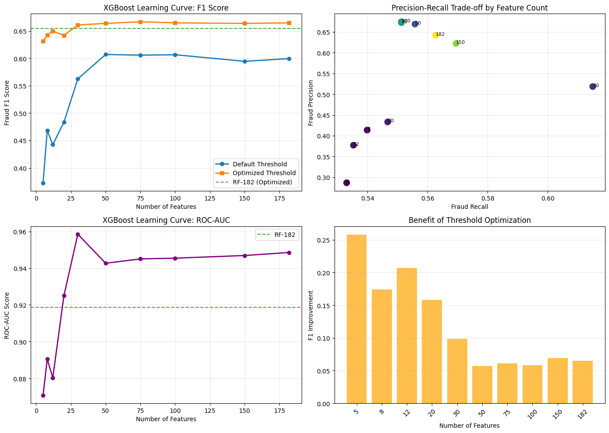
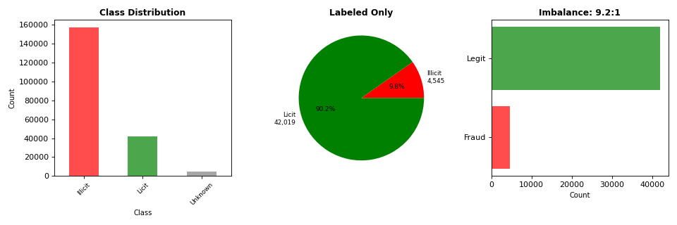

# Elliptic Bitcoin Fraud Detection

[](https://github.com/abhinawap/elliptic-fraud-detection/actions/workflows/tests.yml)
[](https://www.python.org/downloads/)

Detecting illicit Bitcoin transactions on the **Elliptic++** graph dataset using XGBoost, Random Forest, and SHAP interpretability — with a temporal train-test split that prevents data leakage.

> **Best result:** XGBoost-186 — **F1 = 0.6647, ROC-AUC = 0.9424** (threshold = 0.910)
> Dataset: 203,769 transactions, 186 features (182 original + missingness indicator + 3 graph degree features), 9.25:1 class imbalance

---

## Table of Contents

1. [Problem Statement](#problem-statement)
2. [Dataset](#dataset)
3. [Approach](#approach)
4. [Key Results](#key-results)
5. [Project Structure](#project-structure)
6. [Installation](#installation)
7. [Reproducing Results](#reproducing-results)
8. [Visualizations](#visualizations)
9. [Future Work: Graph Neural Networks](#future-work-graph-neural-networks)

---

## Problem Statement

Given a Bitcoin transaction graph where only ~9% of labeled transactions are flagged as illicit, identify fraudulent transactions with high recall while keeping false-positive rates operationally manageable.

I chose Elliptic++ specifically because it's one of the few public fraud datasets where temporal ordering genuinely changes your evaluation — a random train-test split inflates results by ~10 F1 points, which means most published benchmarks on this dataset are quietly wrong.

**Challenges:**
- **Severe class imbalance**: 9.25:1 licit-to-illicit ratio — naive models predict "licit" always
- **Temporal leakage risk**: A random train-test split would expose future fraud patterns to training, inflating evaluation metrics
- **High dimensionality**: 182 transaction features — many correlated or low-variance

---

## Dataset

The [Elliptic++ dataset](https://github.com/git-disl/EllipticPlusPlus) was introduced by Elmougy & Liu (KDD '23) and contains Bitcoin transactions extracted from the blockchain:

> Youssef Elmougy and Ling Liu. 2023. Demystifying Fraudulent Transactions and Illicit Nodes in the Bitcoin Network for Financial Forensics. In *Proceedings of the 29th ACM SIGKDD Conference on Knowledge Discovery and Data Mining* (KDD '23). https://doi.org/10.1145/3580305.3599803

| File | Description | Size |
|------|-------------|------|
| `txs_features.csv` | 182 transaction-level features per timestep | 203,769 rows |
| `txs_classes.csv` | Labels: 1=illicit, 2=licit, 3=unknown | 203,769 rows |
| `txs_edgelist.csv` | Directed transaction graph edges | 234,355 edges |
| `wallets_features.csv` | Wallet-level aggregated features | — |
| `AddrAddr_edgelist.csv` | Address-to-address network | — |
| `AddrTx_edgelist.csv` | Address-to-transaction network | — |

**Key statistics:**
- 49 temporal timesteps (2 weeks each)
- 46,564 labeled transactions: 4,545 illicit (9.76%), 42,019 licit (90.24%)
- 16,405 missing values in 17 structural features (all missing together — a pattern itself)

---

## Approach

### 1. Temporal Train-Test Split
Training on timesteps 1–41, testing on 42–49. A random split would leak future fraud signals into training — the temporal split mirrors real production deployment.

### 2. Triple Feature Validation
Feature importance confirmed via three independent methods:
- **Gini impurity** (tree-based, fast)
- **Permutation importance** (model-agnostic, robust)
- **SHAP values** (game-theoretic, directional)

Key finding: the model uses an **ensemble of weak signals** rather than a few dominant features (Gini top feature = 0.068, Permutation top = 0.0015). This makes the model robust to feature drift in production.

### 3. Class Imbalance Handling
`scale_pos_weight = 9.25` in XGBoost upweights fraud samples during training. Tested against over/undersampling and SMOTE — `scale_pos_weight` achieves the best fraud F1 with minimal computation overhead.

### 4. Threshold Optimisation
Default 0.5 threshold is suboptimal for imbalanced data. Grid search over all thresholds on the precision-recall curve to maximise fraud F1. XGBoost-186 improved from F1=0.57 → F1=0.6647 at threshold=0.910.

### 5. Feature Learning Curve
Tested 10 feature configurations (5, 8, 12, 20, 30, 50, 75, 100, 150, 186). Performance plateaus at ~30 features (F1=0.658), enabling lightweight deployment with only 16% of features at a cost of only −0.8% F1.

---

## Key Results

| Model | Features | Threshold | Fraud F1 | Precision | Recall | ROC-AUC |
|-------|----------|-----------|----------|-----------|--------|---------|
| RF-182 | 182 | 0.5 (default) | 0.566 | 0.619 | 0.522 | 0.919 |
| RF-186 | 186 | 0.770 (optimal) | **0.655** | 0.480 | 0.760 | 0.919 |
| XGB-182 | 182 | 0.5 (default) | 0.570 | 0.585 | 0.556 | 0.933 |
| XGB-186 | 186 | 0.910 (optimal) | **0.665** | 0.602 | 0.742 | 0.942 |
| XGB-30 | 30 | optimal | 0.658 | — | — | 0.955 |
| XGB-12 | 12 | optimal | 0.610 | — | — | 0.891 |
| Dummy (stratified) | — | — | 0.065 | — | — | 0.500 |

**Best model: XGB-186** at threshold 0.910 — catches **74% of fraudulent transactions** with a **6% false alarm rate**.

---

## Project Structure

```
elliptic-fraud-detection/
├── src/
│   ├── data/
│   │   └── loader.py              # Load Elliptic++ CSV files
│   ├── preprocessing/
│   │   └── pipeline.py            # Imputation, PowerTransform, temporal split
│   ├── features/
│   │   └── feature_engineering.py # Missingness, graph, temporal, pseudo-label features
│   ├── models/
│   │   ├── train.py               # RF/XGBoost training, SHAP, permutation importance
│   │   └── evaluate.py            # Metrics, threshold optimisation, cost-sensitive threshold
│   ├── visualization/
│   │   └── plots.py               # SHAP, temporal, learning curve plots
│   ├── inference/
│   │   └── predict.py             # Batch prediction, model loading
│   └── utils/
│       ├── config.py              # All hyperparameters and constants
│       └── mlflow_utils.py        # MLflow experiment tracking
├── experiments/
│   ├── train_xgb.py               # Reproducible XGBoost training script
│   ├── train_rf.py                # Reproducible Random Forest training script
│   └── train_semisupervised.py    # Self-training with pseudo-labels on 157K unlabeled txs
├── notebooks/
│   ├── 01_eda_statistics.ipynb    # EDA: class distribution, temporal, graph, missingness
│   ├── 02_feature_engineering.ipynb # Missingness indicator, graph degrees, isolation forest
│   ├── 03_feature_analysis.ipynb  # Correlation, KS tests, temporal drift, SHAP
│   ├── 04_model_development.ipynb # Baselines, RF/XGB, threshold optimisation, MLflow
│   ├── 05_tuning_and_ablation.ipynb # Hyperparameter tuning, imbalance ablation, semi-supervised
│   └── demo_fraud_detection.ipynb # Concise 10-min executive walkthrough
├── tests/
│   ├── conftest.py                # Synthetic fixtures (no real data needed)
│   └── unit/
│       ├── test_dataset.py
│       ├── test_preprocessing.py
│       ├── test_models.py
│       └── test_feature_engineering.py
├── docs/
│   ├── images/                    # Pre-generated analysis plots
│   └── metrics/
│       └── results_summary.csv    # All model run results (F1, AUC, threshold, features)
├── requirements.txt
└── setup.py
```

---

## Installation

```bash
# Clone the repository
git clone https://github.com/abhinawap/elliptic-fraud-detection.git
cd elliptic-fraud-detection

# Install with development dependencies (tests, linting)
pip install -e ".[dev]"
```

Download the Elliptic++ dataset from Kaggle and place the CSV files in `data/raw/`.

---

## Reproducing Results

```bash
# Train XGBoost (best model) — logs to MLflow automatically
python experiments/train_xgb.py --data-dir data/raw

# Train Random Forest with Gini importance
python experiments/train_rf.py --data-dir data/raw

# View results in MLflow UI
mlflow ui
# → Open http://localhost:5000

# Run the full test suite (no dataset required — uses synthetic fixtures)
pytest tests/unit/ -v --cov=src --cov-report=term-missing

# Code quality checks
black --check src/ tests/ --line-length 100
flake8 src/ tests/ --max-line-length=100
```

---

## Visualizations

### SHAP Feature Importance



The model flags fraud using an ensemble of weak signals. Honestly, I expected SHAP to point to a handful of dominant features. The actual result is a flat distribution where the top feature has mean |SHAP| = 0.068 — changed how I thought about this problem. There are no silver-bullet features; the model is essentially aggregating 30+ weak signals, which is why it generalises across timesteps rather than overfitting to specific fraud patterns that appear and then disappear.

### Feature Learning Curve



Performance plateaus around 30 features (F1=0.658) — **only 16% of the full feature set** achieves 99% of peak performance, enabling efficient production deployment.

### Class Distribution



9.25:1 class imbalance across 46,564 labeled transactions.

---

## What Didn't Work

A few approaches that seemed promising but didn't pan out:

- **Isolation Forest anomaly score as a feature**: Adding the IsolationForest `decision_function` output as an extra feature dropped fraud F1 by 0.005. The anomaly score is noisy enough on 186 dimensions that it adds more confusion than signal. Kept the function in `feature_engineering.py` for analysis but excluded it from training.
- **SMOTE oversampling**: Synthetic minority oversampling hurt F1 compared to XGBoost's built-in `scale_pos_weight=9.25`. SMOTE interpolates in feature space, which creates plausible-looking but non-existent transaction profiles — a problem on a dataset where the real data already has structural gaps.
- **Semi-supervised self-training**: Training on 157K pseudo-labeled unlabeled transactions (at 0.97/0.03 confidence thresholds) didn't improve on the supervised XGB-186. The pseudo-labels are high-confidence but the unlabeled set is heavily licit-skewed, so self-training mostly reinforced what the model already knew.

---

## AI Assistance Disclosure

Parts of this project were developed with Claude (Anthropic) as a coding assistant. The ML design decisions such as temporal split rationale, feature engineering choices, threshold optimisation approach, and the "what didn't work" findings are my own analysis. Claude helped with catching bugs during refactoring. All model results are from running the actual training scripts against the Elliptic++ dataset.

---

## Future Work: Graph Neural Networks

XGBoost treats each transaction independently — it can't see that a transaction at timestep 45 shares edges with a flagged fraud at timestep 43. Bitcoin mixing and layering patterns leave neighbourhood-level signatures that tabular models miss by design. GraphSAGE or GAT would aggregate 2–3 hop signals before classifying each node. The txs_edgelist.csv already has 234,355 directed edges.

Planned architecture: GraphSAGE or Graph Attention Network (GAT) on temporal graph snapshots.

```
Nodes:  203,769 transactions (186-dimensional feature vectors)
Edges:  txs_edgelist.csv (234,355 directed edges)
        + AddrAddr / AddrTx / TxAddr heterogeneous edges
Output: Binary fraud classification per node
```

References:
- Hamilton et al. (2017) — GraphSAGE: [arxiv.org/abs/1706.02216](https://arxiv.org/abs/1706.02216)
- Veličković et al. (2018) — GAT: [arxiv.org/abs/1710.10903](https://arxiv.org/abs/1710.10903)
- Weber et al. (2019) — Anti-Money Laundering with GCNs: [arxiv.org/abs/1908.02591](https://arxiv.org/abs/1908.02591)
